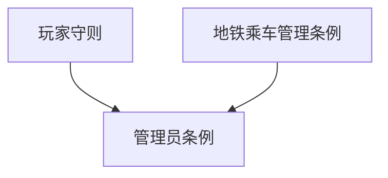

# ChenRay 服务器规则仓库

本仓库收录 ChenRay Minecraft 服务器的全部官方规则文档，供玩家与管理员查阅、执行与维护。

> **服务器信息：** ChenRay 服务器（Minecraft / Paper）｜ QQ 群：108441415

---

## 规则文档

| 文件 | 版本 | 说明 |
|------|------|------|
| [ChenRay服务器玩家守则.md](ChenRay服务器玩家守则.md) | v3.0.0 | 适用于全体玩家的基础行为守则，涵盖总则、游戏行为、处罚申诉、特殊场景，以及入服白名单、领地建筑、经济市场、聊天社区、活动赛事、纠纷仲裁、直播录屏、账号数据保护等专项细则 |
| [ChenRay服务器管理员条例.md](ChenRay服务器管理员条例.md) | v3.0.0 | 规范管理员行为的条例，涵盖总体原则、禁止行为、职责要求、处罚逻辑、特殊参与规则，以及违规封禁规范（含六大类 100+ 条违规封禁对照表、封禁流程、申诉解封、累计加重、公示记录、反作弊申诉） |
| [ChenRay服务器地铁乘车管理条例.md](ChenRay服务器地铁乘车管理条例.md) | v2.0.0 | 地铁系统的乘车规范，依据 Metro 插件功能制定，涵盖设施保护、乘车行为、特殊场景、管理职责 |

## 文档关系

- **玩家守则** 是面向全体玩家的基础行为守则，已整合入服白名单、领地建筑、经济市场、聊天社区、活动赛事、纠纷仲裁、直播录屏、账号数据保护等专项细则
- **管理员条例** 是规范管理员行为的条例，已整合违规封禁规范（含违规封禁对照表、封禁流程、反作弊申诉等专项）
- **地铁乘车管理条例** 是地铁系统的专项规范
- 凡与封禁相关的规定不一致处，以管理员条例中的封禁规范部分为准

## 更新记录

各文件的版本号与更新日期见文件头部。完整的版本演进记录见 [CHANGELOG.md](CHANGELOG.md)。

## 目录

- `*.md` — 规则文档与说明
- `CHANGELOG.md` — 更新日志

---

© ChenRay 运营团队。本仓库规则以不违背国家法律法规、Mojang EULA、微软服务条款为前提。
