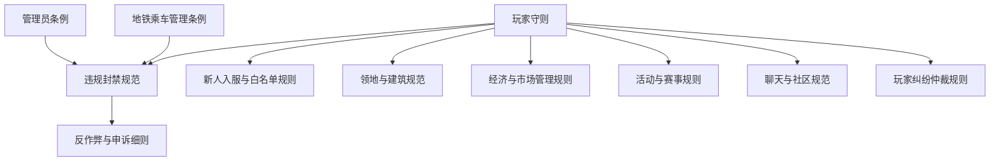

# ChenRay 服务器规则仓库

本仓库收录 ChenRay Minecraft 服务器的全部官方规则文档，供玩家与管理员查阅、执行与维护。

> **服务器信息：** ChenRay 服务器（Minecraft / Paper）｜ QQ 群：108441415

---

## 规则文档

| 文件 | 版本 | 说明 |
|------|------|------|
| [ChenRay服务器玩家守则.md](ChenRay服务器玩家守则.md) | v2.0.0 | 适用于全体玩家的基础行为守则，涵盖公平竞技、建筑领地、社交聊天、经济系统、账号安全、处罚申诉等 |
| [ChenRay服务器管理员条例.md](ChenRay服务器管理员条例.md) | v2.0.0 | 规范管理员行为的条例，涵盖总体原则、禁止行为、职责要求、处罚逻辑、特殊参与规则、附则与解释 |
| [ChenRay服务器地铁乘车管理条例.md](ChenRay服务器地铁乘车管理条例.md) | v2.0.0 | 地铁系统的乘车规范，依据 Metro 插件功能制定，涵盖设施保护、乘车行为、特殊场景、管理职责 |
| [ChenRay服务器违规封禁规范.md](ChenRay服务器违规封禁规范.md) | v1.0.0 | 违规封禁机制的配套规范，含六大类 100+ 条违规封禁对照表、封禁流程、申诉解封、累计加重、公示记录 |
| [ChenRay服务器新人入服与白名单规则.md](ChenRay服务器新人入服与白名单规则.md) | v1.0.0 | 入服申请、白名单管理、新人引导的入门规范 |
| [ChenRay服务器领地与建筑规范.md](ChenRay服务器领地与建筑规范.md) | v1.0.0 | 圈地、领地管理、建筑规范、公共区域保护的细化规范 |
| [ChenRay服务器经济与市场管理规则.md](ChenRay服务器经济与市场管理规则.md) | v1.0.0 | 货币获取、商店规则、拍卖行、交易纠纷处理的细化规范 |
| [ChenRay服务器活动与赛事规则.md](ChenRay服务器活动与赛事规则.md) | v1.0.0 | 活动组织、参与、赛事规则、奖励积分的细化规范 |
| [ChenRay服务器聊天与社区规范.md](ChenRay服务器聊天与社区规范.md) | v1.0.0 | 游戏内聊天、QQ 群、论坛工单的社区交流规范 |
| [ChenRay服务器反作弊与申诉细则.md](ChenRay服务器反作弊与申诉细则.md) | v1.0.0 | 依托 Matrix 反作弊与 LiteBAN 封禁系统的检测、封禁记录查询与申诉细则 |
| [ChenRay服务器玩家纠纷仲裁规则.md](ChenRay服务器玩家纠纷仲裁规则.md) | v1.0.0 | 玩家纠纷类型、仲裁流程、证据标准、仲裁执行的细化规则 |

## 文档关系

- **玩家守则** 与 **管理员条例** 是基础性规章，分别面向玩家与管理员
- **地铁乘车管理条例** 是地铁系统的专项规范
- **违规封禁规范** 作为配套文件，统一规定封禁机制
- **新人入服 / 领地建筑 / 经济市场 / 活动赛事 / 聊天社区** 五个文件是《玩家守则》各章节的配套细化规范
- **反作弊与申诉细则** 依托 Matrix 反作弊与 LiteBAN 封禁系统，是《违规封禁规范》的配套细化文件
- **玩家纠纷仲裁规则** 规范玩家纠纷的仲裁流程
- 凡与封禁相关的规定不一致处，以封禁规范为准

## 更新记录

各文件的版本号与更新日期见文件头部。完整的版本演进记录见 [CHANGELOG.md](CHANGELOG.md)。

## 目录

- `*.md` — 规则文档与说明
- `CHANGELOG.md` — 更新日志

---

© ChenRay 运营团队。本仓库规则以不违背国家法律法规、Mojang EULA、微软服务条款为前提。
