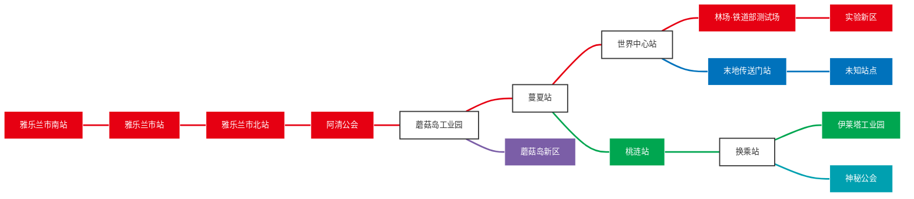

# ChenRay服务器地铁乘车管理条例

> **版本：** v2.0.0 ｜ **更新日期：** 2026.8.30
>
> 为维护服务器地铁系统的稳定运营秩序，保障全体玩家（插件作者除外）的乘车安全与合法权益，规范地铁场景内的玩家行为，结合服务器所使用的 **Metro 地铁系统插件**（支持中英文等多语言切换，兼容 Minecraft 1.18+ 及 Java 17+，支持 Paper / Spigot / Folia 服务端）的实际功能特性，特制定本条例。

**适用范围：** 本条例适用于服务器内所有与地铁系统相关的主体，包括：

- 拥有 `metro.use` 权限的普通乘客玩家
- 拥有 `metro.admin` 权限的服务器管理员
- 拥有线路 / 站点 / 传送门管理权限的建设者与合作玩家

同时覆盖所有地铁车站、轨道、列车、换乘区域、矿车传送门及插件功能模块。**插件作者除外**，其行为不受本条例约束。除插件作者外，所有玩家均需遵守插件功能限制，不得利用漏洞、第三方工具或代码篡改干扰地铁运行，不得擅自修改插件原始文件或绕过权限控制。

**插件作者认定：** 本条例所称"插件作者"指 Metro 插件的开发人员，目前为 **angushushu** 与 **FZaoao**（CubeX 组织）。插件作者仅豁免本条例中与乘车、设施使用相关的条款约束，其游戏内行为仍受《玩家守则》及《管理员条例》违规封禁规范约束。除已认定的插件作者外，任何自称插件作者、冒用插件作者身份的，按冒充处理。

**核心概念说明（依据 Metro 插件）：**

| 概念 | 说明 |
|------|------|
| **线路 (Line)** | 按顺序排列的停靠区列表，定义列车行驶路径 |
| **停靠区 (Stop)** | 由两个对角点定义的三维站台区域 |
| **停靠点 (StopPoint)** | 停靠区内的红石铁轨，玩家右键乘车的位置 |
| **换乘 (Transfer)** | 在停靠区转乘其他线路 |
| **矿车传送门 (Portal)** | 跨区域 / 跨世界传送矿车的装置 |

## 目录

- [一、设施保护规则](#一设施保护规则)
- [二、乘车行为规范](#二乘车行为规范)
- [三、特殊场景要求](#三特殊场景要求)
- [四、管理职责与附则](#四管理职责与附则)

---

## 一、设施保护规则

### 1.1 保护范围

地铁系统是服务器内一项集建筑、红石、插件数据于一体的综合性公共工程，其设施涵盖车站建筑、轨道线路、停靠点（红石铁轨）、列车矿车、候车设施、标识牌、矿车传送门及装饰部件等多个层面。这些设施不仅是玩家日常通勤与运输的重要依托，更凝聚了建设者与管理团队的大量心血。因此，除插件作者和管理员外，任何玩家都不得实施破坏地铁相关设施的行为。

具体而言，被纳入保护范围的设施包括但不限于以下几类：

- **车站建筑**：包括站台主体结构、站厅、出入口、楼梯电梯、候车区、装饰性建筑以及各类标识牌。这些建筑构成了地铁系统的基础外观与功能骨架，任何破坏行为都会直接影响其他玩家的使用体验。
- **轨道与停靠点**：包括轨道方块、道岔、停靠点（红石铁轨）及列车矿车。轨道是地铁运行的物理基础，停靠点是玩家乘车的核心位置，任何损坏或拆除都可能导致线路瘫痪或乘车系统失效。
- **插件数据与配置**：包括插件生成的线路数据（如路线、颜色、终点站、票价、运营状态）、站点配置文件、传送门配置以及系统运行参数。这些数据是地铁系统的"灵魂"，一旦被篡改，可能导致整个系统运行异常甚至崩溃。

### 1.2 安全模式与插件保护机制

Metro 插件内置了**安全模式（Safe Mode）**，为地铁设施提供了基础保护。玩家应了解并遵守这些机制：

- **矿车保护：** 插件默认开启安全模式，运营中的地铁矿车免受实体推动、玩家攻击与破坏，乘客乘坐时禁止破坏铁轨
- **强制下车限制：** 乘客只能在停靠区下车，非停靠区不可下车，以防乘客在轨道中途坠落
- **脱轨处理：** 列车脱轨时，插件会自动将乘客踢出并移除矿车，防止矿车散落阻塞轨道

玩家不得试图绕过这些保护机制，或利用插件漏洞破坏运营中的矿车与铁轨。

### 1.3 禁止行为细则

在明确保护范围的基础上，条例对以下行为作出严格禁止：

1. **破坏车站建筑结构**：不得拆除、挖掘或恶意改动车站的建筑结构、标识牌、候车设施及装饰部件。车站是乘客聚集与换乘的场所，其结构完整性直接关系到乘客安全与秩序。
2. **损坏或拆除轨道与停靠点**：不得损坏或拆除轨道、停靠点（红石铁轨）、信号装置及列车矿车，更不得改变轨道走向或站点布局。轨道一旦被改动，列车运行路径即被打乱，轻则造成晚点，重则导致脱轨或系统报错。
3. **篡改插件数据**：不得篡改插件生成的线路数据、站点配置、传送门配置或系统运行参数。这些数据由插件作者与管理员精心维护，任何未经授权的修改都可能破坏地铁线路的正常运营，甚至引发数据丢失。
4. **破坏停运 / 维护中线路**：线路处于停运（suspended）或维护（maintenance）状态时，玩家不得擅自改动其设施。维护中的线路仍可能载客运行，任何破坏都可能危及乘客安全。

### 1.4 违规处罚

违规处罚按破坏程度划分，实行"分级定责、累犯加重"的原则：

| 破坏程度 | 情形举例 | 处罚 |
|---------|----------|------|
| **轻微破坏** | 损坏单个标识牌 | 给予警告并责令 12 小时内修复，修复前冻结地铁使用权限 |
| **中度破坏** | 拆除 5 格以上轨道或停靠点 | 处以 7–14 天账号封禁，封禁期间由管理员修复，解封后需提交《遵守地铁条例承诺书》，审核通过方可恢复权限 |
| **严重破坏** | 大规模拆轨、破坏运营中矿车、篡改插件核心数据致系统瘫痪 | 处以 30 天至永久封禁，清除其地铁建设记录；若造成服务器数据丢失或额外运维成本，追加限制其他功能使用的惩罚 |

在具体执行处罚时，管理员应对破坏行为的性质、动机、后果及玩家的违规历史进行综合评估。对于因误操作导致的轻微破坏，可视情节从轻处理；对于蓄意破坏、屡教不改或造成严重后果者，则从重处罚。所有处罚决定都应记录在案，并公示在公告区，以起到警示作用，同时保障处罚的公正性与透明度。

---

## 二、乘车行为规范

### 2.1 乘车方式与票价

#### 2.1.1 乘车方式

Metro 插件的乘车方式为：玩家在停靠点的红石铁轨位置**右键**即可呼叫矿车并自动乘坐。乘车前，玩家需确保自己拥有 `metro.use` 权限。无权限者（插件作者除外）无法上车，强行尝试将被视为违规。

#### 2.1.2 票价机制

服务器经济系统接入 Vault 后，乘坐地铁需支付票价。票价由线路 owner 设定，收入自动转入线路 owner 账户。票价支持以下三种模式：

| 计价模式 | 说明 |
|---------|------|
| **固定票价（flat）** | 全程统一基础价 |
| **按距离计价（distance）** | 基础价 + 每方块费率，可设封顶 |
| **按站数计价（interval）** | 基础价 + 每站费率，可设封顶 |

票价可能依据游戏时段设有**分时段折扣**，环形线路按两个方向中较短的站数计费。玩家在乘车前应确认自己账户余额充足，余额不足将无法上车。请勿利用插件漏洞逃票或刷取票价，违者按《管理员条例》第五部分违规封禁对照表 E-016 处理。

### 2.2 候车秩序

候车是乘坐地铁的第一步，良好的候车秩序是保障乘客安全与运行效率的基础。除插件作者外，所有玩家在站台候车时，必须严格遵守以下规定，共同维护站台的安全与整洁。

#### 2.2.1 候车区域要求

玩家应在站台划定的 **"候车区"** 内等待列车进站，严禁进入轨道区域或在站台边缘 1 格范围内逗留。轨道区域是列车的运行通道，任何异物或人员进入都可能引发碰撞、脱轨等事故；站台边缘则存在坠轨风险，尤其在列车高速进站时极易造成角色死亡。因此，玩家必须与轨道保持足够的安全距离，切勿因好奇、取物或抢占位置而越界。

#### 2.2.2 轨道区域禁令

不得在轨道上停留、行走、造方块或放置实体（如矿车、生物）。轨道属于列车专用通道，禁止一切非运行用途的占用。在轨道上造方块会直接阻挡列车通行，放置生物则可能引发混乱，甚至导致列车卡顿或脱轨。任何此类行为都会被视作破坏秩序，并依据情节轻重予以处罚。

#### 2.2.3 站台整洁要求

保持站台整洁是每位乘客应尽的义务。玩家不得在站台丢弃物品、堆放障碍物或设置陷阱。随意丢弃的物品不仅影响美观，还可能造成其他玩家拾取误判或通行受阻；障碍物与陷阱则可能对他人造成伤害或财产损失。请将不需要的物品妥善处理，切勿遗留于站台区域。

#### 2.2.4 文明候车要求

候车期间，玩家应保持文明、有序。不在站台高频刷屏喧哗、挑衅他人或无理由发起 PVP，不传播低俗暴力信息。高频刷屏会干扰其他玩家的正常沟通，挑衅与 PVP 则可能引发冲突、破坏秩序。请以友善、克制的态度与他人相处，共同营造和谐的乘车环境。

#### 2.2.5 突发状况应对

遇列车晚点或故障时，玩家需保持耐心，等待管理员通知，不得起哄造谣或擅自进入轨道查看。列车运行受多种因素影响，偶发晚点属正常现象；擅自进轨不仅危险，还可能干扰管理员排查与修复。请相信管理员会妥善处理，并在第一时间发布相关通知。

### 2.3 上下车规则

上下车是乘车过程中最易发生拥堵与事故的环节。列车到站后，除插件作者外，玩家需严格遵循 **"先下后上"** 原则，文明有序地完成上下车。

#### 2.3.1 先下后上原则

列车到站并停稳后，应等待下车玩家先行离开车厢，再从车门两侧依次上车。切勿拥挤推搡、插队或堵住车门。先下后上不仅能提高通行效率，更能避免因抢行造成的碰撞与踩踏。在客流高峰时段，这一原则尤为重要，请各位玩家自觉遵守。

#### 2.3.2 车厢内行为规范

上车后，玩家应在 **"乘客区"** 就坐或站立，不占车门空间、不堵塞通道。车门区域是乘客上下的必经之路，占用该区域会严重影响他人通行。同时，不得在车内放置方块、打开容器（如箱子、熔炉）或进行合成操作。车厢空间有限，此类行为不仅占用空间，还可能干扰列车运行或造成物品散落。

#### 2.3.3 运行安全要求

列车运行过程中，玩家不得擅自跳车或触碰轨道。插件已限制乘客只能在停靠区下车，非停靠区强行下车将触发脱轨处理，可能导致角色坠落死亡或矿车被移除。若因违规行为导致角色死亡或物品丢失，服务器不予恢复，相关损失由玩家自行承担。请务必在列车完全停稳并到达停靠区后，再行上下车。

#### 2.3.4 及时下车要求

列车到站后，玩家应在 **30 秒内** 有序下车，不长时间停留影响后续玩家。列车运行有固定的时刻表，长时间停留会延误发车，进而影响整条线路的准点率与其他乘客的出行。请到站后及时下车，将车厢空间让给有需要的乘客。

---

## 三、特殊场景要求

### 3.1 换乘要求

换乘是地铁出行中常见的场景，涉及多条线路之间的衔接。合理的换乘行为不仅关系到个人出行效率，更影响整个地铁网络的运行秩序。玩家在换乘时，需严格遵守以下要求。

#### 3.1.1 换乘路线指引

换乘时，玩家需按站内设置的 **"换乘指引牌"** 或插件显示的换乘信息前往目标线路站台。Metro 插件支持为停靠区添加可换乘线路（`/m stop addtransfer`），换乘信息会显示在站点的 Title / Subtitle 及网页地图上。请遵循指引牌与插件提示行进，切勿凭主观判断或随意穿行，以免迷失方向或干扰他人。

#### 3.1.2 换乘通道秩序

换乘通道是连接不同线路的重要通道，玩家不得在通道内停留、堵住路口，也不得翻越隔离设施。换乘通道通常较为狭窄，停留或堵路会阻碍通行、造成拥堵；翻越隔离设施则可能进入危险区域或影响线路运行。请保持通行顺畅，礼让他人。

#### 3.1.3 大件物品携带

携带大量物品（超过一组方块或实体物品）出行时，玩家应确保不占用公共空间或影响他人，不得在列车或站台 **"摆摊"** 进行交易或展示。大件物品本就占用空间，若再在公共区域摆摊，会严重影响他人通行与乘车体验。请合理安排物品携带方式，将公共空间留给更多乘客。

### 3.2 矿车传送门

Metro 插件支持矿车传送门，可实现跨区域 / 跨世界的矿车传送。传送门通过特定触发方块（默认哭泣的黑曜石）激活，并需在传送前设置目的地。

- 玩家乘坐矿车经过传送门时，将被传送到预设的目的地位置
- 传送门必须由线路 owner 通过 `/m line addportal` 启用，未启用的传送门不会触发
- 玩家不得擅自破坏传送门装置或篡改其目的地配置
- 传送门的使用须遵守与普通乘车相同的票价与行为规范

### 3.3 线路运营状态

Metro 插件支持线路的三种运营状态，玩家应了解并遵守相应的乘车规则：

| 运营状态 | 说明 | 可否乘车 |
|---------|------|---------|
| **正常运营（normal）** | 线路正常运行 | ✅ 可以乘车 |
| **停运（suspended）** | 线路暂停运营，可能配置停运公告与替代线路 | ❌ 不可上车 |
| **维护（maintenance）** | 线路处于维护中，仍可载客 | ✅ 可以乘车 |

线路进入停运或维护状态时，运营团队会发布公告并提示替代线路。玩家应遵守停运线路的乘车限制，不得强行上车或干扰维护作业。

### 3.4 权限使用规范

Metro 插件的权限系统分为多个层级，覆盖乘客、建设者与管理员。权限的授予与使用必须严格遵循规范，确保系统安全有序运行。主要权限节点如下：

| 权限节点 | 默认值 | 说明 |
|---------|--------|------|
| `metro.use` | 所有玩家 | 允许使用地铁系统（乘坐列车） |
| `metro.gui` | 所有玩家 | 允许打开管理 GUI（`/m gui`） |
| `metro.tp` | 关闭 | 允许通过命令/GUI 传送到站点 |
| `metro.line.create` | 关闭 | 允许创建新线路 |
| `metro.stop.create` | 关闭 | 允许创建新站点 |
| `metro.portal.create` | 关闭 | 允许创建新矿车传送门 |
| `metro.admin` | 仅 OP | 最高管理权限，可执行全部管理命令 |

#### 3.4.1 乘客权限

普通玩家默认拥有 `metro.use` 与 `metro.gui` 权限，可正常乘车并查看管理界面。无权限者（插件作者除外）不得进入车站或使用相关功能。权限的授予需通过服务器官方渠道申请，杜绝私下授予或冒用。未授权进入车站或使用功能者，一经发现，将视情节处以封禁 **3 天** 的处罚。

#### 3.4.2 建设者权限

参与地铁建设的合作玩家，需由运营团队授予相应的创建与管理权限（如 `metro.line.create`、`metro.stop.create`、`metro.portal.create`）。建设者创建线路 / 站点 / 传送门后，本人自动成为该对象的 owner，可通过 `/m line|stop|portal trust` 授予他人管理权限。

建设者（插件作者除外）需严格按照《地铁管理员操作手册》使用权限，不得滥用权限谋取私利，例如私自添加专属线路、删除合规站点、篡改他人设施等。此类行为严重破坏地铁系统的公平性与完整性，一经发现，将撤销其权限并处以封禁 **7–30 天** 的处罚。

#### 3.4.3 管理员权限

`metro.admin` 权限仅管理员可拥有，是最高管理权限（默认仅 OP），可执行全部管理命令并旁路所有权检查。管理员应严格自律，不得滥用权限。

#### 3.4.4 信任与所有权机制

Metro 插件对线路、站点、传送门实行统一的信任与所有权机制。每个对象都有 owner（所有者）与 admins（管理员列表）：

- 只有对象的 owner 或 admin 才能管理该对象
- 服务器拥有的对象（owner 为空）仅 OP 可管理
- 未经 owner / 管理员许可，任何玩家不得修改他人线路、站点或传送门设施
- 所有权转移（owner 命令）仅限原 owner 执行

#### 3.4.5 权限申请与变更

权限申请需通过服务器 **"权限申请通道"** 进行，由运营团队统一审核与授予。管理员权限的变更需经运营团队集体决策，任何个人无权擅自调整他人权限。规范的权限管理机制，是保障地铁系统长期稳定运行的重要基础。

---

## 四、管理职责与附则

### 4.1 管理员与建设者职责

地铁系统的正常运营离不开管理员与建设者的持续维护与管理。除插件作者外，拥有 `metro.admin` 权限的管理员及拥有管理权限的建设者需切实履行以下职责，保障地铁系统的安全、稳定与高效运行。

#### 4.1.1 定期巡检

管理员应定期检查地铁设施与插件状态，每周至少进行 **1 次** 全线路巡检。巡检内容包括车站建筑结构、轨道与停靠点、列车矿车、线路运营状态以及插件运行数据等。通过定期巡检，能够及时发现并排除潜在隐患，确保地铁系统始终处于良好运行状态。

#### 4.1.2 线路与站点管理

管理员与建设者可通过插件命令进行线路、站点、传送门的管理，包括：

- **线路管理：** 创建 / 删除 / 重命名线路，设置颜色、终点方向、最大速度、票价与运营状态
- **站点管理：** 创建 / 删除 / 重命名站点，设置停靠点、换乘线路与 Title 显示
- **传送门管理：** 创建 / 配对传送门，设置目的地
- **信任管理：** 通过 trust / untrust / owner 命令授予或撤销管理权限

所有管理操作应遵循运营团队的统一规划，不得擅自创建无意义或重复的线路、站点。

#### 4.1.3 及时响应

管理员应在 **24 小时内** 响应玩家反馈的地铁问题，并在 **48 小时内** 给出处理结果。玩家的反馈是发现问题的第一手信息，及时响应与处理不仅体现对玩家的尊重，更能有效避免问题扩大化。对于涉及运行安全或数据完整性的重大问题，应优先处理并上报运营团队。

#### 4.1.4 数据维护

管理员应维护地铁系统的数据安全，定期备份插件配置文件。插件配置是地铁系统的核心数据，一旦丢失或损坏，可能导致线路不可恢复。定期备份能够有效降低数据风险，为系统稳定提供有力保障。

#### 4.1.5 宣传与更新

管理员应定期更新《地铁使用指南》，并每年至少组织 **1 次** 地铁条例宣传活动。通过持续的宣传与教育，帮助玩家更好地了解地铁使用规范，提升整体乘车文明程度，共同营造良好的地铁出行环境。

### 4.2 违规举报与处理

健全的举报与处理机制是维护地铁秩序的重要保障。玩家与管理员应协同配合，共同监督违规行为。

#### 4.2.1 举报渠道

玩家发现违规行为（插件作者除外）时，可通过 **"举报通道"** 提交证据（截图、录像等），并注明违规者 ID、时间、地点及行为描述。详实、完整的举报信息有助于管理员快速核实与处理，提高办案效率。

#### 4.2.2 核实与公示

管理员应在 **12 小时内** 对举报证据进行核实，并在核实属实后依法作出处罚。处罚结果将公示在 **"公告区"**，以起到警示作用并接受玩家监督。公示既是对违规者的惩戒，也是对广大玩家的教育，有助于形成良好的威慑效应。

#### 4.2.3 申诉机制

被处罚者对处罚结果有异议的，可提交申诉。管理员团队将在 **48 小时内** 对申诉进行重审，重审结果为最终结论。申诉机制保障了玩家的合法权益，确保处罚的公正性与准确性，避免因误判造成冤假错案。

### 4.3 附则

- **修订机制：** 本条例将根据服务器需求、插件版本更新（除插件作者外，更新需管理员团队评估）及玩家反馈进行修订，修订版公示 **7 天** 后生效。充分的公示期给予玩家了解与反馈的机会，确保修订内容合理可行。
- **解释权归属：** 条例最终解释权归 **ChenRay 服务器运营团队** 所有。解释权的统一归属，有助于避免因理解分歧导致的执行偏差。
- **冲突处理：** 与其他规则冲突时，以本条例为准；未覆盖的特殊情况，由管理员团队集体决策。明确的冲突处理原则，保障了条例的统一性与权威性。
- **生效时间：** 本条例自发布之日起生效。

---

## 附录：地铁线路与站点一览

> 本附录依据服务器 Metro 插件线路 / 站点数据整理（2026-08-31），供玩家乘车参考。

### 线路示意图

### 线路与站点

| 线路 | 运营方向 | 途经站点（按序） |
|------|----------|------------------|
| **1号线** | 雅乐兰市南 ↔ 实验新区 | 雅乐兰市南站 → 雅乐兰市站 → 雅乐兰市北站 → 阿清公会 → 蘑菇岛工业园 → 蔓夏站 → 世界中心站 → 林场·铁道部测试场 → 实验新区 |
| **2号线** | 未知站点 ↔ 世界中心 | 未知站点 → 末地传送门站 → 世界中心站 |
| **3号线（观光线）** | 蔓夏 ↔ 伊莱塔工业园 | 蔓夏 → 桃涟站 → 换乘站 → 伊莱塔工业园 |
| **观光线支线** | 换乘站 ↔ 神秘公会 | 换乘站 → 神秘公会 |
| **蘑菇岛支线** | 蘑菇岛工业园 ↔ 蘑菇岛新区 | 蘑菇岛工业园 → 蘑菇岛新区 |

**换乘站：** 世界中心站（1 / 2 号线）、蔓夏站（1 / 3 号线，观光线站名为「蔓夏」）、蘑菇岛工业园（1 号线 / 蘑菇岛支线）、换乘站（3 号线 / 观光线支线）。

**测试 / 未接入客运线路：** speedtest（测速线）、lt（t1/t2）、cs1（djdf）、ces、建筑世界（空线）。

---

**ChenRay 交通部门**

2026.8.30
